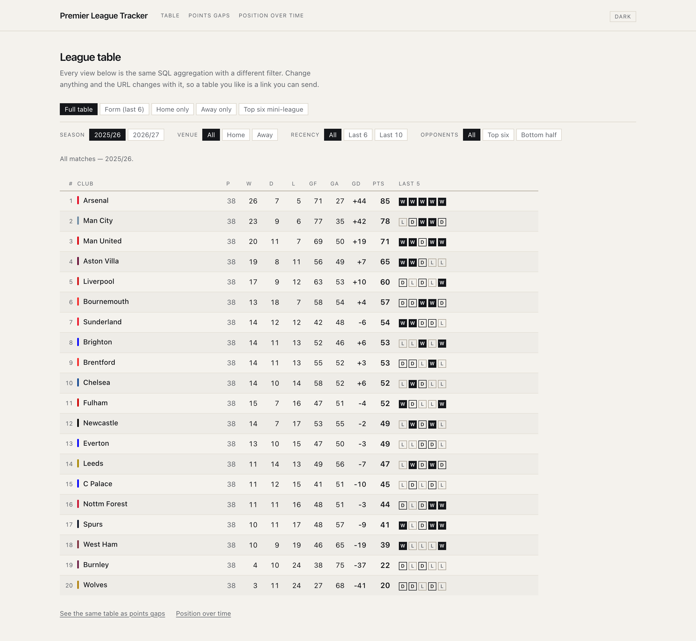
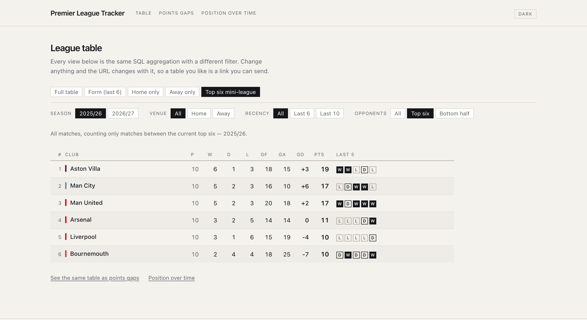
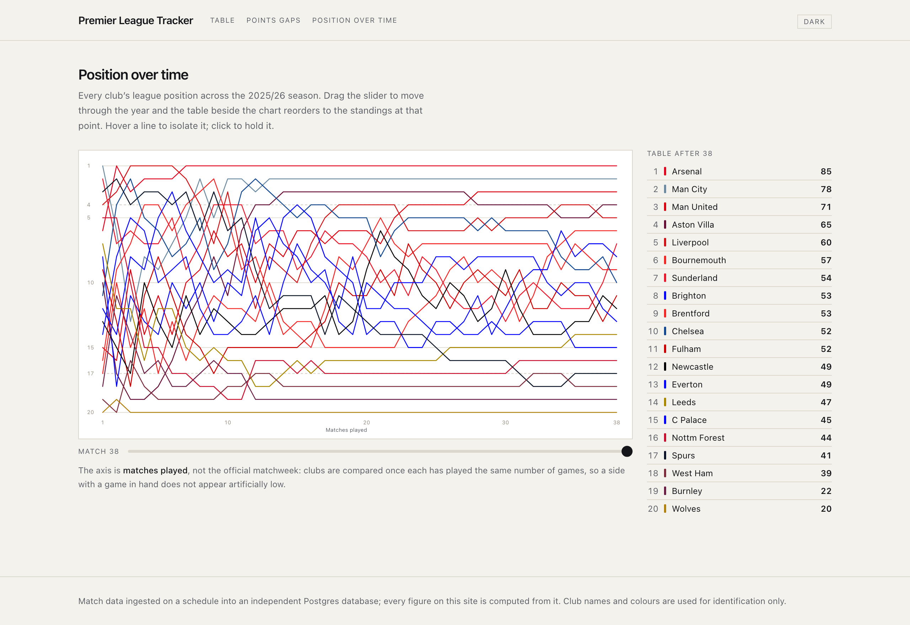
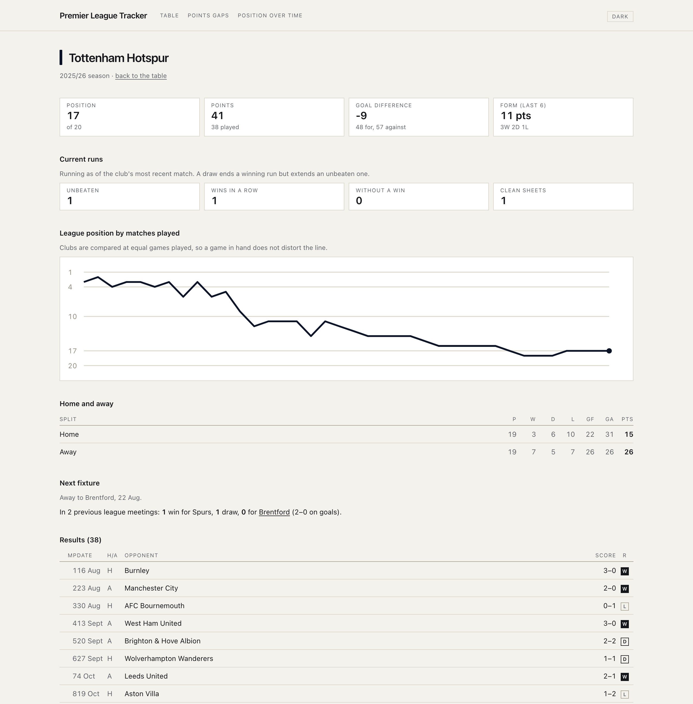
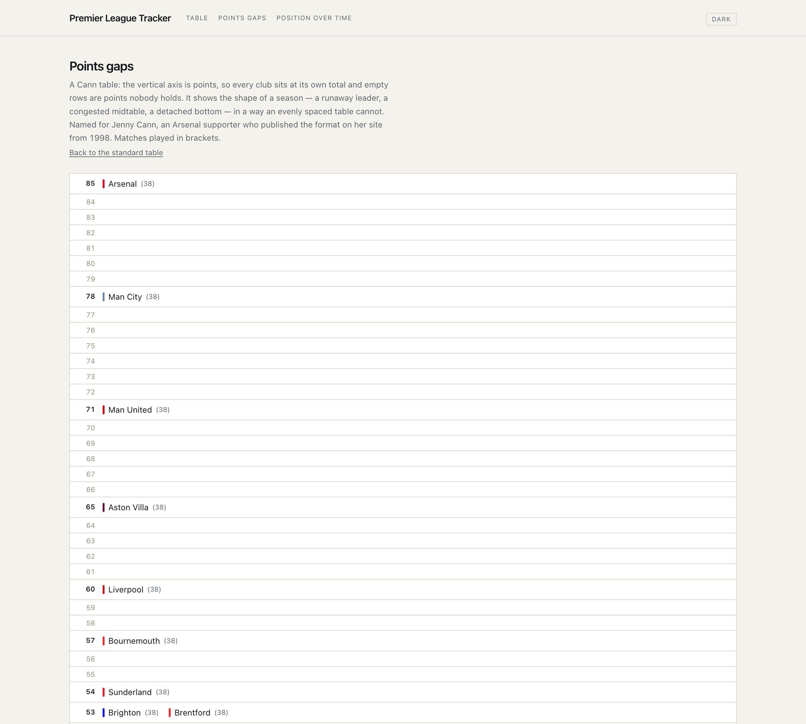
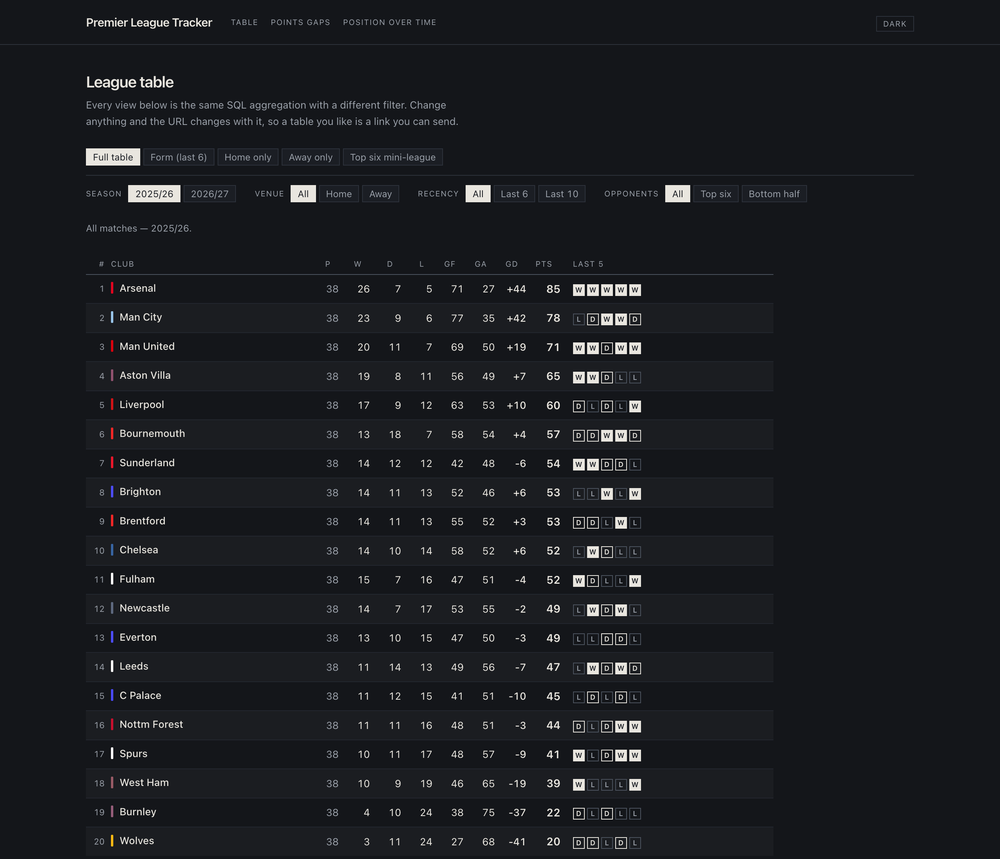
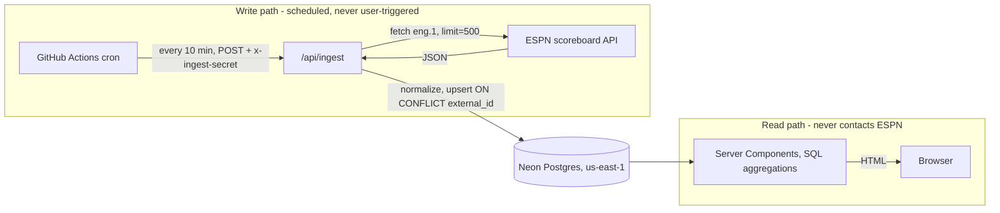

# Premier League Tracker

A Premier League data platform with its own ingestion pipeline. It pulls match
data from ESPN's public API on a schedule, normalizes it into Postgres, and
computes statistics the source doesn't provide — the league table, form,
streaks, head-to-head.

**Live:** https://premier-league-tracker-alpha.vercel.app


---

## What it looks like

**The table.** Every view is one SQL aggregation with a different filter —
venue, recency, opponent set, sort — and each control changes only a query
parameter, so the page ships no client JavaScript and any filtered table is a
shareable link.



**Top-six mini-league.** Only matches *between* the top six. Arsenal won the
league by seven points and finish fourth here; Aston Villa finished fourth
overall and top this. One predicate, a completely different story — and not
something the source API can answer.



**Position over time.** Hand-written SVG, no charting library. One line per
club, y-axis inverted, and a scrubber that moves through the season while the
table beside it reorders to the standings at that point.



**Club page.** Position, form, current streaks, home and away splits, that
club's position line, every result, and the head-to-head record against their
next opponent.



**Points gaps.** The same standings as a Cann table: points are the vertical
axis, so the space between clubs *is* the gap.



Both themes follow `prefers-color-scheme`, with a toggle to override it.



---

## The problem

Public football APIs give you fixtures and scores. They don't give you the
things people actually want to look at: where a club sits in the table, whether
they're on a run, how a season unfolded week by week. Those are aggregations
over history, and history is exactly what a stateless API call doesn't have.

Proxying the source on every page load makes this worse. Reads inherit upstream
latency and downtime, there's no history to aggregate over, and a third-party
API absorbs one request per visitor.

So this stores the data instead. A scheduled job owns all upstream contact; the
user-facing read path only ever touches our own Postgres.

## Architecture



The important line in that diagram is the one that doesn't exist: nothing in the
read path points at ESPN.

## Working against an undocumented API

ESPN's scoreboard endpoint has no docs and no auth. Two things found by
inspecting it directly, both of which would have quietly corrupted the data:

**The response caps at 100 events.** Requesting a full season returns exactly
100 matches — not an error, not a paging cursor, just silent truncation. A
Premier League season is 380. Passing `limit=500` returns all of them. Left
undetected, every form and streak calculation would have run over roughly a
quarter of the season and produced numbers that looked entirely plausible.

**`week` is always `null`.** Verified across all 760 stored matches. Matchweek
simply isn't in the payload, so it has to be derived from match history rather
than read. The column is nullable because pretending otherwise would mean
storing a number the source never gave us.

### How matchweek is derived, and why it isn't the official one

A match is assigned the matchweek of the **later-playing of its two clubs** —
`max(home club's Nth match, away club's Nth match)`.

A match has two clubs, and as soon as a fixture is rearranged their cumulative
match counts diverge (18 of 380 matches in 2025/26). Crystal Palace v Wolves on
22 Feb is Palace's 27th match and Wolves' 28th, so a naive per-club count gives
one row two different answers. Taking the *minimum* would label it week 27, and
a "table after week 27" would then show Wolves having played 28 games. Taking
the maximum means a match only counts once both clubs have reached that point,
so no club can ever show more games played than the week you asked for.

**This is a games-played index, not the official matchweek**, and the
difference is deliberate. The official matchweek is a fixture-list label fixed
before the season: a match postponed from round 27 keeps the label 27 even when
it's played in May, which is why official tables at a given round show clubs on
unequal games. That label isn't in the payload and can't be recovered.

The games-played ordering is also the better axis for tracking position over
time — a club's line moves because of results, not because it happened to play
an extra fixture that week. The cost is that week 27 here won't match week 27 on
the BBC for a club with a rearranged fixture. In 2025/26 that affects Crystal
Palace and Spurs, who each carried a game in hand from week 27 until it was
played on 13 May; 18 club-weeks sit one game behind the label and the other 742
are exact.

## Data model

```
teams    (id, external_id UNIQUE, name, short_name, crest_url)
matches  (id, external_id UNIQUE, competition, season, matchweek,
          kicks_off_at, status, home_team_id FK, away_team_id FK,
          home_goals, away_goals, minute, stoppage_minute, updated_at)
```

Indexed on `kicks_off_at`, `status`, `(competition, season)`, and both team
foreign keys. Schema changes go through committed Drizzle migrations in
[`drizzle/`](drizzle/), never through the Neon console.

Two deliberate choices:

- **`competition` exists from day one** and is `'eng.1'` on every row. Widening
  past the league later needs no migration.
- **`minute` and `stoppage_minute` are separate columns.** A football clock
  counts up across two halves and adds stoppage on top, so `90'+7'` is minute 90
  plus 7 — not minute 97. Collapsing them sorts a stoppage-time event ahead of a
  genuine 93rd-minute one in extra time.

## Ingest guarantees

**Idempotent.** Every upsert targets a natural key (`external_id`) with
`ON CONFLICT DO UPDATE`. Verified rather than assumed: 760 matches ingested four
times over, still 760 rows, zero duplicates.

**Fails partially, not totally.** Matches upsert in chunks of 100 for speed; if
a chunk fails, it retries row by row so good records still land and only
genuinely bad ones are reported as skipped. A run that skips two of 380 matches
is a successful run with a warning, not a failed one.

Batching took a full-season backfill from **33.7s to 1.25s (27×)** — sequential
per-row upserts would not have survived a serverless function timeout.

**Protected.** `/api/ingest` is guarded by a shared secret compared with
`timingSafeEqual`, so response timing doesn't leak how much of the secret
matched.

## Club colours, and why they need a rule

Colours come from the source, but a colour that identifies a club is not
necessarily a colour you can see. Five of twenty clubs in 2025/26 play in white
or near-white and would be invisible on the light ground; on the dark ground the
problem inverts and it is Newcastle's black that vanishes.

One function resolves every club to a legible colour per theme, and everything
that paints a club calls it:

1. Use the primary if it clears 3:1 against the active ground.
2. If it fails and has no hue to preserve, use the secondary if that clears.
3. Otherwise adjust it — darker on the light ground, lighter on the dark one —
   keeping hue and saturation.

Step 2's condition is the part that matters. Swapping whenever a fallback
exists would send Newcastle from black to their white secondary and darken it to
a hueless grey. Adjusting a light primary that *has* hue beats swapping to a
secondary that identifies nothing: Manchester City resolve to a deep sky blue
rather than the black their secondary would give, and Wolves stay gold.

Verified for all 23 stored clubs against both grounds, including the three
promoted for 2026/27 — Coventry and Hull both needed adjusting, which is the
argument for a rule over a hand-maintained list.

## Performance

The read path never calls ESPN, so page latency is a database round trip plus
render. Pages use `revalidate` rather than recomputing per request, since
2025/26 never changes and 2026/27 changes only when ingest runs.

The honest number: a **cold start measures ~2.7s**. That is a serverless
function boot plus a first connection to Neon, not query time — the same route
warm returns in a fraction of that, and the ingest endpoint round-trips in
**168ms**. Both are measured, not estimated. Removing the cold start means
keeping a function warm or moving off a scale-to-zero platform, which is not
worth doing for a portfolio project, so it is recorded rather than hidden.

## Running locally

```bash
npm install
cp .env.example .env.local     # add your Neon connection string + an ingest secret
npm run db:migrate             # apply committed migrations
npx tsx scripts/ingest.ts --season 2025   # backfill a season
npm run dev
```

```bash
npm test           # Vitest
npm run typecheck  # tsc --noEmit
```

## Stack

Next.js (App Router) · TypeScript · Tailwind · Drizzle ORM · Neon Postgres ·
Vercel · GitHub Actions · Vitest

## Tests and CI

`tsc --noEmit`, ESLint, Vitest and a production build run on every pull request
and every push to `main`.

The query tests run against **PGlite — real PostgreSQL compiled to WebAssembly**
— applying the committed migrations, so window functions, lateral joins and the
`derived_matchweeks` view behave exactly as they do on Neon. No database
service, no secrets, and a fork's pull request runs them identically.

Fixtures are a four-club league whose every value is computable by hand,
covering a draw, a goalless draw, a postponed fixture, a promoted club with no
prior-season history, and clubs level on every tiebreaker. One test asserts the
league *balances* — goals for equals goals against and goal difference sums to
zero — which catches a lateral join that ever double-counts a club or drops a
side of a fixture.

## Status

Complete. 760 matches across two seasons and 23 clubs, ingested on a 10-minute
schedule, with the table, form, streaks, head-to-head, matchweek derivation and
position history all computed in SQL.

Deliberately not built: live score push, a cache layer (the derived queries are
single-digit milliseconds over 760 rows, and claiming a cache that wasn't needed
would be dishonest), accounts, and player-level statistics.
