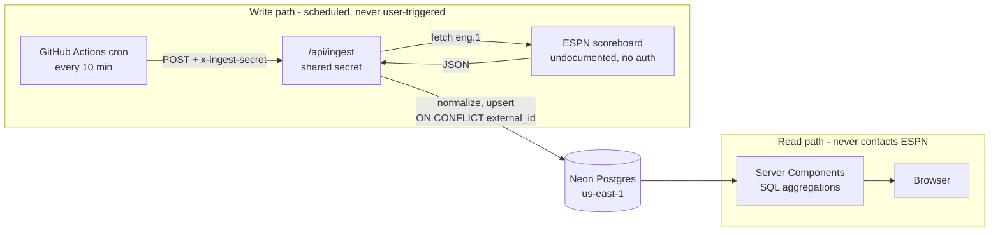

# Premier League Tracker

A Premier League data platform with its own ingestion pipeline. It pulls match
data from ESPN's public API on a schedule, normalizes it into Postgres, and
computes statistics the source doesn't provide — the league table, form,
streaks, head-to-head.

**Live:** https://premier-league-tracker-alpha.vercel.app

---

## The problem

Public football APIs give you fixtures and scores. They don't give you the
things people actually want to look at: where a club sits in the table, whether
they're on a run, how a season unfolded week by week. Those are aggregations
over history, and history is exactly what a stateless API call doesn't have.

Proxying the source on every page load makes this worse. Reads inherit upstream
latency and downtime, there's no history to aggregate over, and a third-party
API absorbs one request per visitor.

So this stores the data instead. A scheduled job owns all upstream contact; the
user-facing read path only ever touches our own Postgres.

## Architecture



The important line in that diagram is the one that doesn't exist: nothing in the
read path points at ESPN.

## Working against an undocumented API

ESPN's scoreboard endpoint has no docs and no auth. Two things found by
inspecting it directly, both of which would have quietly corrupted the data:

**The response caps at 100 events.** Requesting a full season returns exactly
100 matches — not an error, not a paging cursor, just silent truncation. A
Premier League season is 380. Passing `limit=500` returns all of them. Left
undetected, every form and streak calculation would have run over roughly a
quarter of the season and produced numbers that looked entirely plausible.

**`week` is always `null`.** Verified across all 760 stored matches. Matchweek
simply isn't in the payload, so it has to be derived from match history rather
than read. The column is nullable because pretending otherwise would mean
storing a number the source never gave us.

## Data model

```
teams    (id, external_id UNIQUE, name, short_name, crest_url)
matches  (id, external_id UNIQUE, competition, season, matchweek,
          kicks_off_at, status, home_team_id FK, away_team_id FK,
          home_goals, away_goals, minute, stoppage_minute, updated_at)
```

Indexed on `kicks_off_at`, `status`, `(competition, season)`, and both team
foreign keys. Schema changes go through committed Drizzle migrations in
[`drizzle/`](drizzle/), never through the Neon console.

Two deliberate choices:

- **`competition` exists from day one** and is `'eng.1'` on every row. Widening
  past the league later needs no migration.
- **`minute` and `stoppage_minute` are separate columns.** A football clock
  counts up across two halves and adds stoppage on top, so `90'+7'` is minute 90
  plus 7 — not minute 97. Collapsing them sorts a stoppage-time event ahead of a
  genuine 93rd-minute one in extra time.

## Ingest guarantees

**Idempotent.** Every upsert targets a natural key (`external_id`) with
`ON CONFLICT DO UPDATE`. Verified rather than assumed: 760 matches ingested four
times over, still 760 rows, zero duplicates.

**Fails partially, not totally.** Matches upsert in chunks of 100 for speed; if
a chunk fails, it retries row by row so good records still land and only
genuinely bad ones are reported as skipped. A run that skips two of 380 matches
is a successful run with a warning, not a failed one.

Batching took a full-season backfill from **33.7s to 1.25s (27×)** — sequential
per-row upserts would not have survived a serverless function timeout.

**Protected.** `/api/ingest` is guarded by a shared secret compared with
`timingSafeEqual`, so response timing doesn't leak how much of the secret
matched.

## Running locally

```bash
npm install
cp .env.example .env.local     # add your Neon connection string + an ingest secret
npm run db:migrate             # apply committed migrations
npx tsx scripts/ingest.ts --season 2025   # backfill a season
npm run dev
```

```bash
npm test           # Vitest
npm run typecheck  # tsc --noEmit
```

## Stack

Next.js (App Router) · TypeScript · Tailwind · Drizzle ORM · Neon Postgres ·
Vercel · GitHub Actions · Vitest

## Status

Ingestion, backfill, and scheduling are live. Both the completed 2025/26 season
and the 2026/27 fixture list are loaded — 760 matches across 23 clubs.

Next: derived statistics as SQL aggregations (league table with full
tiebreakers, form, streaks, head-to-head) and the interface built on top of them.
